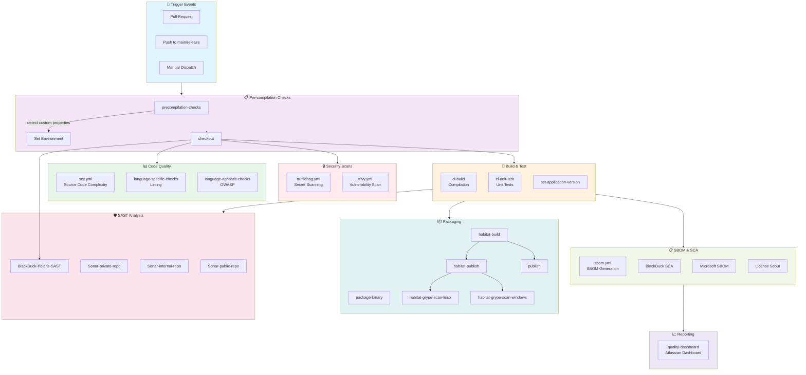
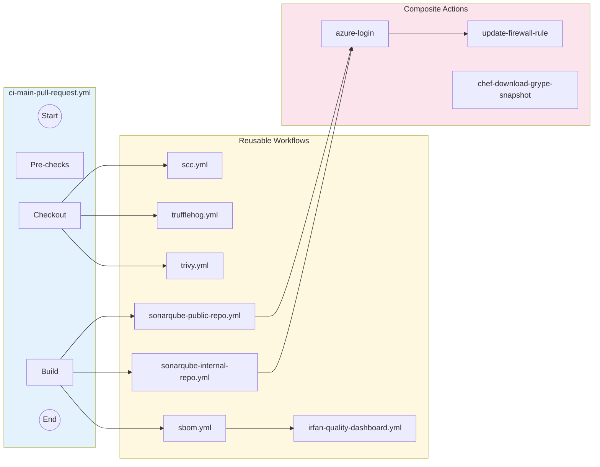
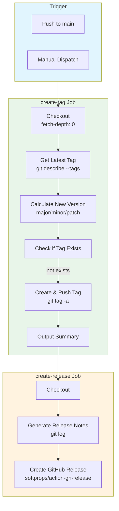
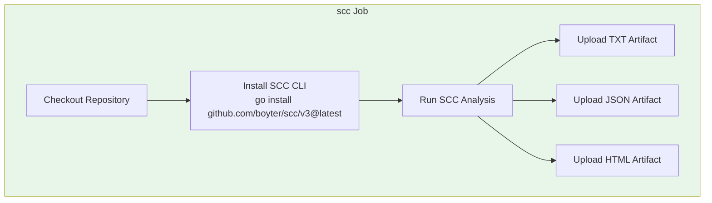
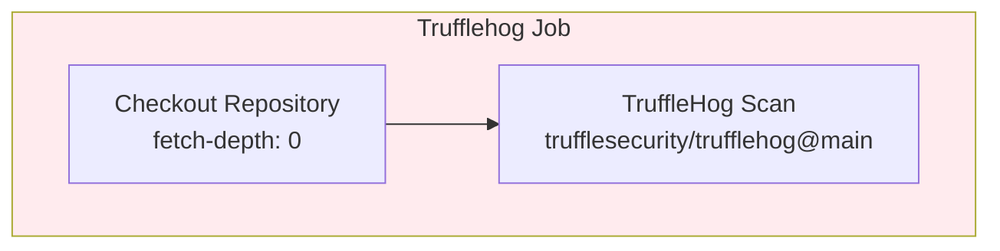
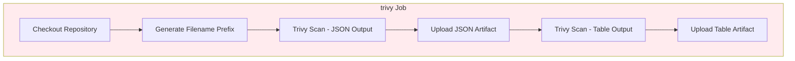
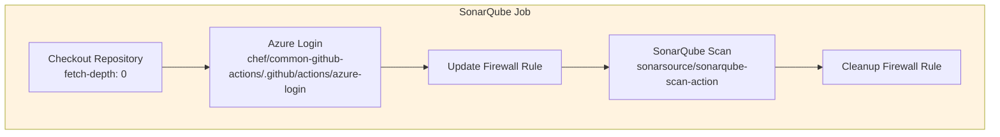
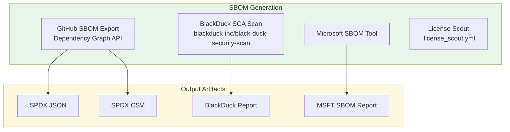
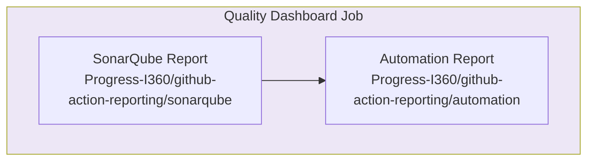

# HOW-TO-USE: Chef Common GitHub Actions

This guide explains how to use the reusable workflows from the `chef/common-github-actions` repository in your own projects.

---

## Table of Contents

- [Quick Start](#quick-start)
- [Versioning with Tags](#versioning-with-tags)
- [Available Workflows](#available-workflows)
- [CI/CD Pipeline Architecture](#cicd-pipeline-architecture)
- [Workflow Reference](#workflow-reference)
  - [CI Main Pull Request](#ci-main-pull-request)
  - [Create Release Tag](#create-release-tag)
  - [SCC (Source Code Complexity)](#scc-source-code-complexity)
  - [TruffleHog (Secret Scanning)](#trufflehog-secret-scanning)
  - [Trivy (Vulnerability Scanning)](#trivy-vulnerability-scanning)
  - [SonarQube (SAST)](#sonarqube-sast)
  - [SBOM Generation](#sbom-generation)
  - [Quality Dashboard](#quality-dashboard)
- [Required Secrets](#required-secrets)
- [Configuration Examples](#configuration-examples)

---

## Quick Start

### Step 1: Copy the Stub Workflow

Copy the stub file to your repository's `.github/workflows/` directory:

```yaml
# .github/workflows/ci-main-pull-request.yml
name: CI Pull Request on Main Branch

on: 
  pull_request:
    branches: [ main, release/** ]
  push:
    branches: [ main, release/** ]
  workflow_dispatch:

permissions:
  contents: read
  
jobs: 
  call-ci-main-pr-check-pipeline:
    uses: chef/common-github-actions/.github/workflows/ci-main-pull-request.yml@v1.0.7
    secrets: inherit
    permissions: 
      id-token: write
      contents: read
    with:   
      visibility: ${{ github.event.repository.visibility }}
      language: 'go'  # go, ruby, rust
      perform-complexity-checks: true
      perform-trufflehog-scan: true
      perform-trivy-scan: true
      perform-sonarqube-scan: true
      generate-sbom: true
```

### Step 2: Configure Required Secrets

Ensure your repository or organization has the following secrets configured:

| Secret | Purpose |
|--------|---------|
| `SONAR_TOKEN` | SonarQube authentication |
| `SONAR_HOST_URL` | SonarQube server URL |
| `POLARIS_ACCESS_TOKEN` | BlackDuck Polaris authentication |
| `POLARIS_SERVER_URL` | BlackDuck Polaris server URL |
| `BLACKDUCK_SCA_TOKEN` | BlackDuck SCA authentication |
| `BLACKDUCK_SBOM_URL` | BlackDuck SCA server URL |

### Step 3: Add sonar-project.properties

Copy the appropriate template from `workflow-supporting-files/sonar-templates/` to your repository root:

```bash
# For Go projects
cp GO-sonar-project.properties sonar-project.properties

# For Ruby projects
cp RUBY-sonar-project.properties sonar-project.properties

# For Rust projects
cp RUST-sonar-project.properties sonar-project.properties
```

---

## Versioning with Tags

The `common-github-actions` repository uses semantic versioning tags to allow projects to reference specific versions:

```yaml
# Reference a specific version (recommended for stability)
uses: chef/common-github-actions/.github/workflows/ci-main-pull-request.yml@v1.0.7

# Reference the latest from main (use with caution)
uses: chef/common-github-actions/.github/workflows/ci-main-pull-request.yml@main
```

### Tag Format

Tags follow semantic versioning: `v{MAJOR}.{MINOR}.{PATCH}`

- **MAJOR**: Breaking changes
- **MINOR**: New features, backward compatible
- **PATCH**: Bug fixes, backward compatible

### Create Release Tag Workflow

When code is merged to `main` in `common-github-actions`, a new tag is automatically created. You can also trigger manual tag creation:

```yaml
# Manual tag creation with version bump
workflow_dispatch:
  inputs:
    version_bump: 'minor'  # major, minor, or patch
```

---

## Available Workflows

| Workflow | Purpose | File |
|----------|---------|------|
| CI Main Pull Request | Complete CI pipeline with security scans | `ci-main-pull-request.yml` |
| Create Release Tag | Auto-tag on merge to main | `create-release-tag.yml` |
| SCC | Source code complexity analysis | `scc.yml` |
| TruffleHog | Secret scanning | `trufflehog.yml` |
| Trivy | Vulnerability scanning | `trivy.yml` |
| SonarQube (Public) | SAST for public repos | `sonarqube-public-repo.yml` |
| SonarQube (Internal) | SAST for internal repos | `sonarqube-internal-repo.yml` |
| SBOM | Software Bill of Materials | `sbom.yml` |
| Quality Dashboard | Atlassian quality reporting | `irfan-quality-dashboard.yml` |

---

## CI/CD Pipeline Architecture

### Complete Pipeline Flow



### Nested Workflow Dependencies



---

## Workflow Reference

### CI Main Pull Request

The main CI workflow that orchestrates all security and quality checks.

**Workflow File:** `ci-main-pull-request.yml`

#### Input Variables



```mermaid
flowchart TB
    subgraph Required["Required Inputs"]
        visibility["visibility<br/>(public/private/internal)"]
        language["language<br/>(go/ruby/rust)"]
    end

    subgraph Version["Version Configuration"]
        version["version<br/>default: 1.0.0"]
        detect_type["detect-version-source-type<br/>(none/file/github-tag/github-release)"]
        detect_param["detect-version-source-parameter"]
    end

    subgraph CodeQuality["Code Quality Flags"]
        complexity["perform-complexity-checks<br/>default: true"]
        linting["perform-language-linting<br/>default: true"]
        scc_output["scc-output-filename<br/>default: scc-complexity"]
    end

    subgraph Security["Security Scan Flags"]
        trufflehog["perform-trufflehog-scan<br/>default: true"]
        trivy["perform-trivy-scan<br/>default: true"]
        polaris["perform-blackduck-polaris<br/>default: false"]
        sonar["perform-sonarqube-scan<br/>default: true"]
        docker["perform-docker-scan<br/>default: false"]
    end

    subgraph Polaris["Polaris Configuration"]
        pol_app["polaris-application-name"]
        pol_proj["polaris-project-name"]
        pol_work["polaris-working-directory"]
        pol_mode["polaris-assessment-mode<br/>(SAST/CI/SOURCE_UPLOAD)"]
        pol_wait["wait-for-scan<br/>default: true"]
    end

    subgraph Build["Build Configuration"]
        build["build<br/>default: true"]
        build_profile["build-profile<br/>default: cli"]
        unit_tests["unit-tests<br/>default: true"]
        unit_output["unit-test-output-path"]
        unit_cmd["unit-test-command-override"]
    end

    subgraph Habitat["Habitat Configuration"]
        hab_build["habitat-build<br/>default: true"]
        hab_publish["publish-habitat-packages<br/>default: false"]
        hab_pkg["publish-habitat-hab_package"]
        hab_ver["publish-habitat-hab_version"]
        hab_rel["publish-habitat-hab_release"]
        hab_ch["publish-habitat-hab_channel<br/>default: stable"]
        hab_os["publish-habitat-runner_os<br/>default: ubuntu-latest"]
        hab_grype["habitat-grype-scan<br/>default: false"]
    end

    subgraph SBOM["SBOM Configuration"]
        gen_sbom["generate-sbom<br/>default: true"]
        gh_sbom["export-github-sbom<br/>default: true"]
        msft_sbom["generate-msft-sbom<br/>default: true"]
        license["license_scout<br/>default: true"]
        bd_sca["perform-blackduck-sca-scan<br/>default: false"]
        bd_group["blackduck-project-group-name<br/>default: Chef"]
        bd_proj["blackduck-project-name"]
    end

    subgraph Quality["Quality Dashboard"]
        report_dash["report-to-atlassian-dashboard<br/>default: true"]
        report_cov["report-unit-test-coverage<br/>default: true"]
        q_prod["quality-product-name"]
        q_sonar["quality-sonar-app-name"]
        q_type["quality-testing-type"]
        q_svc["quality-service-name"]
        q_junit["quality-junit-report"]
    end

    style Required fill:#ffcdd2
    style Version fill:#c8e6c9
    style CodeQuality fill:#bbdefb
    style Security fill:#ffecb3
    style Polaris fill:#f8bbd9
    style Build fill:#d1c4e9
    style Habitat fill:#b2dfdb
    style SBOM fill:#c5cae9
    style Quality fill:#dcedc8
```

#### Complete Input Reference

| Input | Type | Default | Description |
|-------|------|---------|-------------|
| `application` | string | - | Application from repository custom properties |
| `visibility` | string | `public` | Repository visibility (public/private/internal) |
| `go-private-modules` | string | `github.com/progress-platform-services/*` | GOPRIVATE for Go modules |
| `version` | string | `1.0.0` | Project version |
| `detect-version-source-type` | string | `none` | Version detection method |
| `detect-version-source-parameter` | string | - | Parameter for version detection |
| `language` | string | `ruby` | Build language (go/ruby/rust) |
| `perform-complexity-checks` | boolean | `true` | Run SCC complexity checks |
| `scc-output-filename` | string | `scc-complexity` | SCC output filename |
| `perform-language-linting` | boolean | `true` | Run language-specific linting |
| `perform-trufflehog-scan` | boolean | `true` | Run TruffleHog secret scan |
| `perform-trivy-scan` | boolean | `true` | Run Trivy vulnerability scan |
| `build` | boolean | `true` | Run CI build |
| `build-profile` | string | `cli` | Build profile |
| `unit-tests` | boolean | `true` | Run unit tests |
| `unit-test-output-path` | string | `test/unittest` | Unit test output path |
| `unit-test-command-override` | string | - | Custom unit test command |
| `perform-blackduck-polaris` | boolean | `false` | Run BlackDuck Polaris SAST |
| `polaris-application-name` | string | - | Polaris application name |
| `polaris-project-name` | string | `${{ github.event.repository.name }}` | Polaris project name |
| `polaris-working-directory` | string | `.` | Polaris working directory |
| `polaris-config-path` | string | - | Detect configuration file path |
| `polaris-coverity-config-path` | string | - | Coverity configuration file path |
| `polaris-coverity-build-command` | string | `go build` | Coverity build command |
| `polaris-coverity-clean-command` | string | `go clean` | Coverity clean command |
| `polaris-coverity-args` | string | - | Additional Coverity arguments |
| `polaris-detect-search-depth` | string | - | Detect search depth |
| `polaris-detect-args` | string | - | Additional Detect arguments |
| `polaris-assessment-mode` | string | `CI` | Assessment mode (SAST/CI/SOURCE_UPLOAD) |
| `wait-for-scan` | boolean | `true` | Wait for scan completion |
| `perform-sonarqube-scan` | boolean | `true` | Run SonarQube scan |
| `perform-docker-scan` | boolean | `false` | Run Docker scan |
| `report-unit-test-coverage` | boolean | `true` | Report unit test coverage |
| `report-to-atlassian-dashboard` | boolean | `true` | Report to quality dashboard |
| `quality-product-name` | string | `Chef360` | Product name for reporting |
| `quality-sonar-app-name` | string | `YourSonarAppName` | Sonar application name |
| `quality-testing-type` | string | `Integration` | Testing type |
| `quality-service-name` | string | `YourServiceOrRepoName` | Service name |
| `quality-junit-report` | string | `path/to/junit/report` | JUnit report path |
| `package-binaries` | boolean | `true` | Package binaries |
| `habitat-build` | boolean | `true` | Create Habitat packages |
| `publish-habitat-packages` | boolean | `false` | Publish Habitat packages |
| `publish-habitat-hab_package` | string | `core/nginx` | Habitat package name |
| `publish-habitat-hab_version` | string | - | Habitat package version |
| `publish-habitat-hab_release` | string | - | Habitat package release |
| `publish-habitat-hab_channel` | string | `stable` | Habitat channel |
| `publish-habitat-hab_auth_token` | string | - | Habitat auth token |
| `publish-habitat-runner_os` | string | `ubuntu-latest` | Habitat runner OS |
| `habitat-grype-scan` | boolean | `false` | Scan Habitat packages with Grype |
| `publish-packages` | boolean | `true` | Publish packages |
| `generate-sbom` | boolean | `true` | Generate SBOM |
| `export-github-sbom` | boolean | `true` | Export GitHub SBOM |
| `generate-msft-sbom` | boolean | `true` | Generate Microsoft SBOM |
| `license_scout` | boolean | `true` | Run license scout |
| `perform-blackduck-sca-scan` | boolean | `false` | Run BlackDuck SCA scan |
| `blackduck-project-group-name` | string | `Chef` | BlackDuck project group |
| `blackduck-project-name` | string | `${{ github.event.repository.name }}` | BlackDuck project name |
| `blackduck-force-low-accuracy-mode` | boolean | `false` | Force low accuracy mode |
| `run-bundle-install` | boolean | `false` | Run bundle install before scanning |
| `udf1` | string | `default` | User defined flag 1 |
| `udf2` | string | `default` | User defined flag 2 |
| `udf3` | string | `default` | User defined flag 3 |

---

### Create Release Tag

Automatically creates a git tag when code is merged to main.

**Workflow File:** `create-release-tag.yml`

#### Workflow Diagram



#### Input Variables

| Input | Type | Default | Description |
|-------|------|---------|-------------|
| `version_bump` | choice | `patch` | Version bump type (major/minor/patch) |
| `custom_version` | string | - | Custom version (overrides version_bump) |

#### Usage Example

```yaml
name: Create Release Tag

on:
  push:
    branches: [ main ]
  workflow_dispatch:
    inputs:
      version_bump:
        description: 'Version bump type'
        required: true
        default: 'patch'
        type: choice
        options: [major, minor, patch]

permissions:
  contents: write

jobs:
  create-tag:
    uses: chef/common-github-actions/.github/workflows/create-release-tag.yml@main
    secrets: inherit
    permissions:
      contents: write
    with:
      version_bump: ${{ inputs.version_bump || 'patch' }}
```

---

### SCC (Source Code Complexity)

Generates source code complexity metrics using SCC.

**Workflow File:** `scc.yml`

#### Workflow Diagram



#### Input Variables

| Input | Type | Default | Description |
|-------|------|---------|-------------|
| `outputfilename` | string | `scc-complexity` | Name of output file (without extension) |

#### Output Artifacts

- `{repo}-{branch}-{timestamp}-scc-complexity.txt` - Tabular format
- `{repo}-{branch}-{timestamp}-scc-complexity.json` - JSON detailed format
- `{repo}-{branch}-{timestamp}-scc-complexity.html` - HTML detailed format

---

### TruffleHog (Secret Scanning)

Scans for accidentally committed secrets in the repository.

**Workflow File:** `trufflehog.yml`

#### Workflow Diagram



#### Input Variables

None - this workflow has no required inputs.

---

### Trivy (Vulnerability Scanning)

Scans for vulnerabilities in dependencies.

**Workflow File:** `trivy.yml`

#### Workflow Diagram



#### Input Variables

| Input | Type | Default | Description |
|-------|------|---------|-------------|
| `outputfilename` | string | `trivy-output.json` | Output filename |
| `version` | string | `1.0.0` | Project version |

---

### SonarQube (SAST)

Static Application Security Testing using SonarQube.

**Workflow Files:**
- `sonarqube-public-repo.yml` - For public repositories
- `sonarqube-internal-repo.yml` - For internal repositories
- Inline implementation for private repositories

#### Workflow Diagram



#### Input Variables

| Input | Type | Required | Description |
|-------|------|----------|-------------|
| `perform-build` | boolean | No | Whether to perform build |
| `build-profile` | string | No | Build profile |
| `language` | string | No | Programming language |
| `report-unit-test-coverage` | boolean | No | Report test coverage |
| `report-to-atlassian-dashboard` | boolean | No | Report to dashboard |
| `quality-product-name` | string | No | Product name |
| `quality-sonar-app-name` | string | No | Sonar application name |
| `quality-testing-type` | string | No | Testing type |
| `quality-service-name` | string | No | Service name |
| `quality-junit-report` | string | No | JUnit report path |
| `visibility` | string | No | Repository visibility |
| `go-private-modules` | string | No | GOPRIVATE setting |
| `udf1`, `udf2`, `udf3` | string | No | User defined flags |

---

### SBOM Generation

Generates Software Bill of Materials in multiple formats.

**Workflow File:** `sbom.yml`

#### Workflow Diagram



#### Input Variables

| Input | Type | Default | Description |
|-------|------|---------|-------------|
| `version` | string | Required | Project version |
| `export-github-sbom` | boolean | `true` | Export GitHub SBOM |
| `perform-blackduck-sca-scan` | boolean | `false` | Run BlackDuck SCA |
| `blackduck-project-group-name` | string | `Chef` | BlackDuck project group |
| `blackduck-project-name` | string | - | BlackDuck project name |
| `generate-msft-sbom` | boolean | `true` | Generate Microsoft SBOM |
| `license_scout` | boolean | `true` | Run license scout |
| `go-private-modules` | string | - | GOPRIVATE setting |
| `blackduck-force-low-accuracy-mode` | boolean | `false` | Force low accuracy mode |
| `run-bundle-install` | boolean | `false` | Run bundle install |
| `language` | string | `ruby` | Project language |

---

### Quality Dashboard

Reports quality metrics to the Atlassian dashboard.

**Workflow File:** `irfan-quality-dashboard.yml`

#### Workflow Diagram



#### Input Variables

Same as SonarQube inputs - see [SonarQube Input Variables](#input-variables-3).

---

## Required Secrets

Configure these secrets at the repository or organization level:

### SonarQube

| Secret | Description |
|--------|-------------|
| `SONAR_TOKEN` | SonarQube authentication token |
| `SONAR_HOST_URL` | SonarQube server URL (progress.sonar.com) |
| `AKEYLESS_JWT_ID` | For Azure firewall rules (public/internal repos) |

### BlackDuck Polaris (SAST)

| Secret | Description |
|--------|-------------|
| `POLARIS_SERVER_URL` | Polaris server URL (https://polaris.blackduck.com) |
| `POLARIS_ACCESS_TOKEN` | Polaris authentication token |

### BlackDuck SCA

| Secret | Description |
|--------|-------------|
| `BLACKDUCK_SBOM_URL` | BlackDuck SCA server URL |
| `BLACKDUCK_SCA_TOKEN` | BlackDuck SCA authentication token |

### Habitat

| Secret | Description |
|--------|-------------|
| `HAB_PUBLIC_BLDR_PAT` | Habitat Builder personal access token |

### GitHub

| Secret | Description |
|--------|-------------|
| `GITHUB_TOKEN` | Automatically provided by GitHub Actions |
| `GH_TOKEN` | For accessing private Go modules |

---

## Configuration Examples

### Go Project (CLI Application)

```yaml
name: CI Pipeline

on:
  pull_request:
    branches: [ main ]
  push:
    branches: [ main ]

jobs:
  ci:
    uses: chef/common-github-actions/.github/workflows/ci-main-pull-request.yml@v1.0.7
    secrets: inherit
    permissions:
      id-token: write
      contents: read
    with:
      visibility: ${{ github.event.repository.visibility }}
      language: 'go'
      version: '1.0.0'
      build-profile: 'cli'
      
      # Code Quality
      perform-complexity-checks: true
      perform-language-linting: true
      
      # Security Scans
      perform-trufflehog-scan: true
      perform-trivy-scan: true
      perform-sonarqube-scan: true
      
      # BlackDuck Polaris
      perform-blackduck-polaris: true
      polaris-application-name: 'Chef-Chef360'
      polaris-project-name: ${{ github.event.repository.name }}
      polaris-assessment-mode: 'SAST'
      
      # Build
      build: true
      unit-tests: true
      
      # SBOM
      generate-sbom: true
      perform-blackduck-sca-scan: true
      blackduck-project-group-name: 'Chef-Chef360'
```

### Ruby Project (Gem)

```yaml
name: CI Pipeline

on:
  pull_request:
    branches: [ main ]
  push:
    branches: [ main ]

jobs:
  ci:
    uses: chef/common-github-actions/.github/workflows/ci-main-pull-request.yml@v1.0.7
    secrets: inherit
    permissions:
      id-token: write
      contents: read
    with:
      visibility: ${{ github.event.repository.visibility }}
      language: 'ruby'
      version: '1.0.0'
      
      # Code Quality
      perform-complexity-checks: true
      perform-language-linting: true
      
      # Security Scans
      perform-trufflehog-scan: true
      perform-trivy-scan: true
      perform-sonarqube-scan: true
      
      # Build
      build: true
      unit-tests: true
      run-bundle-install: true  # For projects without committed Gemfile.lock
      
      # SBOM
      generate-sbom: true
      license_scout: true
```

### Habitat Package

```yaml
name: CI Pipeline

on:
  pull_request:
    branches: [ main ]
  push:
    branches: [ main ]

jobs:
  ci:
    uses: chef/common-github-actions/.github/workflows/ci-main-pull-request.yml@v1.0.7
    secrets: inherit
    permissions:
      id-token: write
      contents: read
    with:
      visibility: ${{ github.event.repository.visibility }}
      language: 'rust'
      
      # Security Scans
      perform-trufflehog-scan: true
      perform-trivy-scan: true
      
      # Packaging
      package-binaries: true
      habitat-build: true
      publish-habitat-packages: true
      publish-habitat-hab_package: 'myorg/mypackage'
      publish-habitat-hab_channel: 'stable'
      publish-habitat-runner_os: 'ubuntu-latest'
      habitat-grype-scan: true
      
      # SBOM
      generate-sbom: true
```

### Minimal Security Scan Only

```yaml
name: Security Scan

on:
  pull_request:
    branches: [ main ]

jobs:
  security:
    uses: chef/common-github-actions/.github/workflows/ci-main-pull-request.yml@v1.0.7
    secrets: inherit
    with:
      visibility: ${{ github.event.repository.visibility }}
      language: 'go'
      
      # Disable everything except security scans
      perform-complexity-checks: false
      perform-language-linting: false
      build: false
      unit-tests: false
      package-binaries: false
      habitat-build: false
      generate-sbom: false
      report-to-atlassian-dashboard: false
      
      # Enable security scans only
      perform-trufflehog-scan: true
      perform-trivy-scan: true
```

---

## Support

For issues or questions:

1. Check the [DEV-README.md](.github/workflows/DEV-README.md) for development notes
2. Review the [combined-documentation.md](combined-documentation.md) for detailed tool information
3. Open an issue in this repository

---

## Version History

| Version | Date | Changes |
|---------|------|---------|
| v1.0.7 | 2025 | Added Polaris configuration options, Go build/test, Habitat Grype scanning |
| v1.0.5 | 2024 | Initial release with core security scanning |
