# CI/CD Security and Quality Scanning Tools - Complete Reference

This document provides comprehensive information about the security and quality scanning tools configured in the CI/CD pipeline, including their purpose, configuration requirements, and integration details.

---

## Pipeline Overview

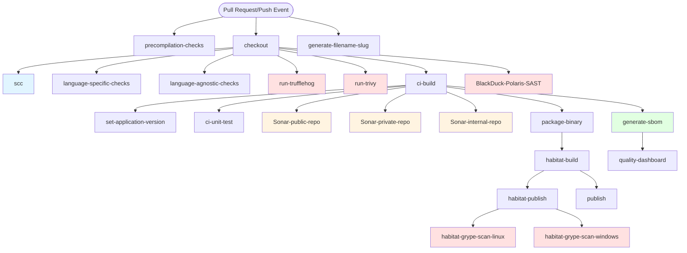

---

## Code Quality & Complexity

### **SCC (Source Code Complexity)**

**Purpose:** Analyzes source code complexity metrics including lines of code, cyclomatic complexity, and comment ratios across multiple programming languages.

**What it scans:** 
- Lines of code (physical, logical, comments)
- Cyclomatic complexity
- Code structure and organization

**Reporting:**
- Generates a text output file (default: `scc-complexity.txt`)
- Uploaded as a GitHub Actions artifact
- Used to track code maintainability over time

#### Job Mapping

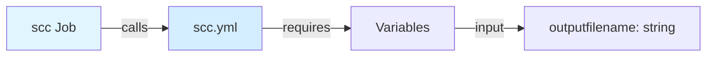

**Workflow File:** `chef/common-github-actions/.github/workflows/scc.yml`

**Required Variables:**
- `outputfilename` (string) - Name of the SCC complexity output file artifact, default: 'scc-complexity'

**Condition:** `inputs.perform-complexity-checks == true`

---

## Language-Specific Analysis

### **Linting Tools**

**Purpose:** Perform language-specific code quality checks and enforce coding standards.

**Supported Languages:**
- **Go**: golangci-lint, staticcheck
- **Ruby**: RuboCop
- **Rust**: Clippy

**What they scan:**
- Code style violations
- Potential bugs
- Performance issues
- Best practice violations

**Reporting:**
- Console output in GitHub Actions logs
- Can fail the build based on severity

#### Job Mapping

**Workflow File:** Inline implementation in `ci-main-pull-request.yml`

**Required Variables:**
- `language` (string) - Programming language (go, ruby, rust)
- `go-private-modules` (string) - GOPRIVATE for Go private modules (if language is Go)

**Condition:** `inputs.perform-language-linting == true`

---

## Secret Scanning

### **TruffleHog**

**Purpose:** Scans for accidentally committed secrets, credentials, and sensitive information in source code and git history.

**What it scans:**
- API keys and tokens
- Passwords
- Private keys
- Database connection strings
- Cloud provider credentials

**Reporting:**
- Results displayed in GitHub Actions logs
- Can be configured to fail the build if secrets are found
- Integrated findings available through the workflow

#### Job Mapping

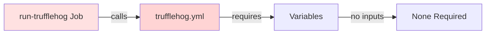

**Workflow File:** `chef/common-github-actions/.github/workflows/trufflehog.yml`

**Required Variables:**
- None (inherits secrets automatically)

**Condition:** `inputs.perform-trufflehog-scan == true`

---

## Vulnerability Scanning

### **Trivy**

**Purpose:** Comprehensive security scanner for vulnerabilities in dependencies, container images, and infrastructure as code.

**What it scans:**
- OS packages and dependencies
- Application dependencies (npm, pip, gem, etc.)
- Container images
- Infrastructure as Code (IaC) misconfigurations

**Reporting:**
- JSON/SARIF output formats
- Results uploaded as GitHub Actions artifacts
- Integration with GitHub Security tab (if SARIF format enabled)

#### Job Mapping

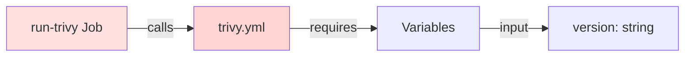

**Workflow File:** `chef/common-github-actions/.github/workflows/trivy.yml`

**Required Variables:**
- `version` (string) - Version of the project, default: '1.0.0'

**Condition:** `inputs.perform-trivy-scan == true`

---

## Static Application Security Testing (SAST)

### **BlackDuck Polaris (Coverity)**

**Purpose:** Enterprise-grade static analysis for identifying security vulnerabilities and code quality issues in source code.

**What it scans:**
- Security vulnerabilities (CWE/OWASP categories)
- Code quality defects
- Compliance violations
- API misuse

**Configuration:**
- Application name: Maps to Chef product (e.g., Chef-Chef360, Chef-Habitat)
- Project name: Typically the repository name
- Assessment modes: SAST, CI, or SOURCE_UPLOAD
- Configurable build commands and scan depth

**Reporting:**
- Results available at: `https://polaris.blackduck.com`
- Project-specific dashboard with vulnerability details
- Can block builds based on policy violations
- SARIF reports can be uploaded to GitHub Security

#### Job Mapping

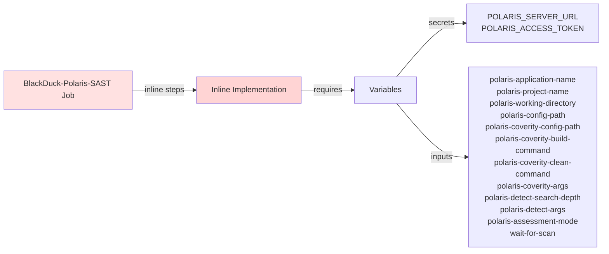

**Workflow File:** Inline implementation (no separate workflow)

**Required Secrets:**
- `POLARIS_SERVER_URL` - BlackDuck Polaris server URL
- `POLARIS_ACCESS_TOKEN` - BlackDuck Polaris access token
- `GITHUB_TOKEN` - GitHub token for authentication

**Required Variables:**
- `polaris-application-name` (string) - One of: Chef-Agents, Chef-Automate, Chef-Chef360, Chef-Habitat, Chef-Infrastructure-Server, Chef-Shared-Services
- `polaris-project-name` (string) - Typically the repository name

**Optional Variables (New in 1.0.7):**
- `polaris-working-directory` (string) - Working directory for scan
- `polaris-config-path` (string) - Path to Detect configuration file
- `polaris-coverity-config-path` (string) - Path to Coverity configuration file
- `polaris-coverity-build-command` (string) - Coverity build command
- `polaris-coverity-clean-command` (string) - Coverity clean command
- `polaris-coverity-args` (string) - Additional Coverity arguments
- `polaris-detect-search-depth` (string) - Detect search depth, default: '5'
- `polaris-detect-args` (string) - Additional Detect arguments
- `polaris-assessment-mode` (string) - Assessment mode: SAST, CI, or SOURCE_UPLOAD
- `wait-for-scan` (boolean) - Wait for scan completion, default: true

**Condition:** `inputs.perform-blackduck-polaris == true`

---

### **SonarQube**

**Purpose:** Continuous code quality and security inspection platform that identifies bugs, code smells, and security vulnerabilities.

**What it scans:**
- Security vulnerabilities
- Code smells and maintainability issues
- Code coverage from unit tests
- Duplicate code
- Technical debt

**Configuration:**
- Separate workflows for public, private, and internal repositories
- Integrates with unit test coverage reports
- Language-specific analysis rules

**Reporting:**
- Results available at configured SonarQube server (progress.sonar.com)
- Quality Gate status (pass/fail)
- Detailed metrics on code quality, security, and coverage
- Historical trends and project comparison

#### Job Mapping - Public Repository

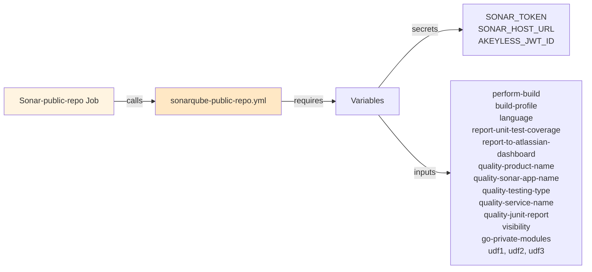

**Workflow File:** `chef/common-github-actions/.github/workflows/sonarqube-public-repo.yml`

**Required Secrets:**
- `SONAR_TOKEN` - SonarQube authentication token
- `SONAR_HOST_URL` - SonarQube server URL (progress.sonar.com)
- `AKEYLESS_JWT_ID` - For Azure firewall rules

**Required Variables:**
- `perform-build` (boolean) - Whether to perform build
- `build-profile` (string) - Build profile, default: 'cli'
- `language` (string) - Programming language
- `report-unit-test-coverage` (boolean) - Report unit test coverage
- `report-to-atlassian-dashboard` (boolean) - Report to QA dashboard
- `quality-product-name` (string) - Product name, default: 'Chef360'
- `quality-sonar-app-name` (string) - Sonar application name
- `quality-testing-type` (string) - Testing type, default: 'Integration'
- `quality-service-name` (string) - Service/repository name
- `quality-junit-report` (string) - Path to JUnit report
- `visibility` (string) - Repository visibility
- `go-private-modules` (string) - GOPRIVATE for Go modules
- `udf1`, `udf2`, `udf3` (string) - User defined flags

**Condition:** `inputs.perform-sonarqube-scan == true && inputs.visibility == 'public'`

#### Job Mapping - Private Repository

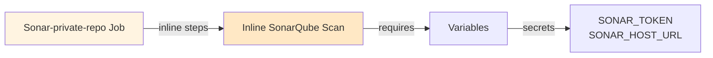

**Workflow File:** Inline implementation using `sonarsource/sonarqube-scan-action@v5.3.1`

**Required Secrets:**
- `SONAR_TOKEN` - SonarQube authentication token
- `SONAR_HOST_URL` - SonarQube server URL

**Condition:** `inputs.perform-sonarqube-scan == true && inputs.visibility == 'private'`

#### Job Mapping - Internal Repository

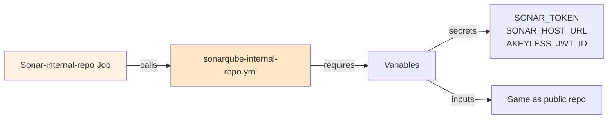

**Workflow File:** `chef/common-github-actions/.github/workflows/sonarqube-internal-repo.yml`

**Required Variables:** Same as public repository

**Condition:** `inputs.perform-sonarqube-scan == true && inputs.visibility == 'internal'`

---

## Software Composition Analysis (SCA)

### **BlackDuck SCA (Sbominator)**

**Purpose:** Identifies open source components, licenses, and known vulnerabilities in dependencies.

**What it scans:**
- Open source dependencies
- License compliance
- Known vulnerabilities (CVEs)
- Component versions and updates

**Configuration:**
- Project group: Maps to Chef product groups
- Project name: Typically repository name
- Requires version specification for accurate tracking

**Reporting:**
- Results at: `https://progresssoftware.app.blackduck.com`
- SBOM generation in SPDX format
- License compliance reports
- Vulnerability risk analysis
- Policy violation alerts

#### Job Mapping

**Note:** BlackDuck SCA is integrated within the SBOM generation workflow (see SBOM Generation section below).

**Workflow File:** `chef/common-github-actions/.github/workflows/sbom.yml`

**Required Secrets:**
- `BLACKDUCK_SBOM_URL` - BlackDuck SCA server URL
- `BLACKDUCK_SCA_TOKEN` - BlackDuck SCA authentication token

**Condition:** `inputs.perform-blackduck-sca-scan == true` (within SBOM workflow)

---

### **Grype (Habitat Package Scanning)**

**Purpose:** Vulnerability scanner specifically used for scanning built Habitat packages.

**What it scans:**
- Installed packages within Habitat artifacts
- Known CVEs in package dependencies
- OS-level vulnerabilities

**Reporting:**
- Text output files uploaded as GitHub Actions artifacts
- Separate scans for Linux and Windows platforms
- Results named: `grype-results-{platform}-{package}.txt`

#### Job Mapping - Linux

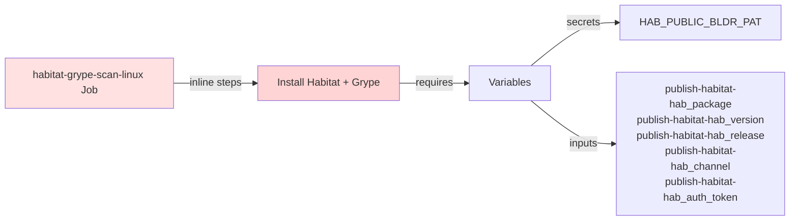

**Workflow File:** Inline implementation

**Required Secrets:**
- `HAB_PUBLIC_BLDR_PAT` - Habitat Builder personal access token (fallback)

**Required Variables:**
- `publish-habitat-hab_package` (string) - Habitat package to scan, default: 'core/nginx'
- `publish-habitat-hab_version` (string) - Package version (optional)
- `publish-habitat-hab_release` (string) - Package release (optional)
- `publish-habitat-hab_channel` (string) - Package channel, default: 'stable'
- `publish-habitat-hab_auth_token` (string) - Auth token (optional, uses secret if not provided)

**Condition:** `inputs.habitat-grype-scan == true && inputs.publish-habitat-runner_os == 'ubuntu-latest'`

#### Job Mapping - Windows

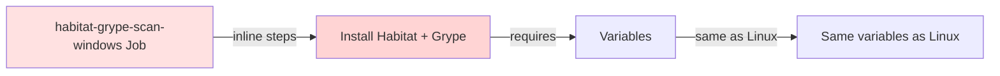

**Workflow File:** Inline implementation

**Required Variables:** Same as Linux version

**Condition:** `inputs.habitat-grype-scan == true && inputs.publish-habitat-runner_os == 'windows-latest'`

---

## Software Bill of Materials (SBOM)

### **GitHub SBOM Export**

**Purpose:** Generates and exports SPDX-compliant SBOM for dependency tracking.

**What it includes:**
- All project dependencies
- Component versions
- License information
- Package relationships

**Reporting:**
- SPDX JSON format
- Uploaded as GitHub Actions artifact
- Can be submitted to BlackDuck SCA for analysis

#### Job Mapping

**Note:** GitHub SBOM Export is integrated within the SBOM generation workflow.

**Condition:** `inputs.export-github-sbom == true` (within SBOM workflow)

---

### **Microsoft SBOM Tool**

**Purpose:** Alternative SBOM generation using Microsoft's tooling.

**What it includes:**
- SPDX 2.2 format
- Component inventory
- License data

**Reporting:**
- JSON artifacts uploaded to workflow
- Integration with supply chain security tools

#### Job Mapping

**Note:** Microsoft SBOM Tool is integrated within the SBOM generation workflow.

**Condition:** `inputs.generate-msft-sbom == true` (within SBOM workflow)

---

### **License Scout**

**Purpose:** Scans project dependencies for license compliance using `.license_scout.yml` configuration.

**What it scans:**
- Dependency licenses
- License compatibility
- Compliance violations

**Reporting:**
- License compliance report
- Violations flagged based on policy

#### Job Mapping

**Note:** License Scout is integrated within the SBOM generation workflow.

**Condition:** `inputs.license_scout == true` (within SBOM workflow)

---

### **SBOM Generation (Combined Workflow)**

**Purpose:** Orchestrates multiple SBOM generation tools and BlackDuck SCA scanning.

#### Job Mapping

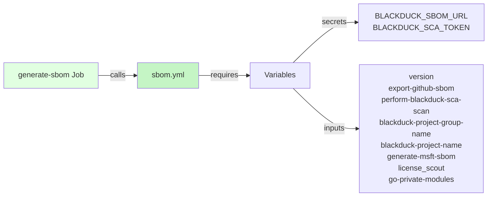

**Workflow File:** `chef/common-github-actions/.github/workflows/sbom.yml`

**Required Secrets:**
- `BLACKDUCK_SBOM_URL` - BlackDuck SCA server URL
- `BLACKDUCK_SCA_TOKEN` - BlackDuck SCA authentication token

**Required Variables:**
- `version` (string) - Version of the project
- `export-github-sbom` (boolean) - Export SBOM from GitHub, default: true
- `perform-blackduck-sca-scan` (boolean) - Perform BlackDuck SCA scan, default: false
- `blackduck-project-group-name` (string) - BlackDuck project group, default: 'Chef'
- `blackduck-project-name` (string) - BlackDuck project name
- `generate-msft-sbom` (boolean) - Generate Microsoft SBOM, default: true
- `license_scout` (boolean) - Run license scout, default: true
- `go-private-modules` (string) - GOPRIVATE for Go modules

**Condition:** `inputs.generate-sbom == true`

---

## Quality Dashboard Integration

### **Atlassian Quality Dashboard**

**Purpose:** Aggregates quality metrics from multiple sources for centralized reporting.

**Data Sources:**
- SonarQube metrics
- Unit test results (JUnit format)
- Code coverage data

**Reported Metrics:**
- Product: Chef-360, Courier, InSpec, etc.
- Service/Repository name
- Testing type: Unit, Integration, e2e, API, Performance, Security
- Quality gate status

**Reporting:**
- Centralized dashboard (Irfan's QA dashboard)
- Historical trend analysis
- Cross-project comparison

#### Job Mapping

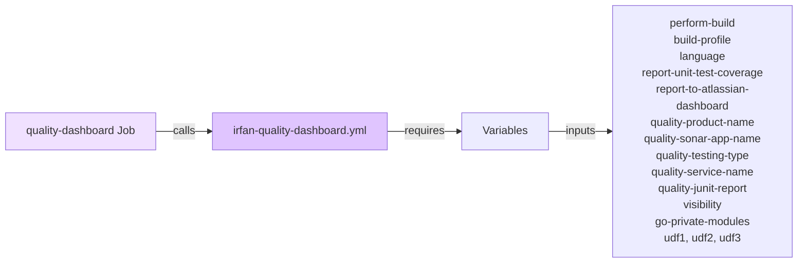

**Workflow File:** `chef/common-github-actions/.github/workflows/irfan-quality-dashboard.yml`

**Required Variables:**
- `perform-build` (boolean) - Whether build was performed
- `build-profile` (string) - Build profile
- `language` (string) - Programming language
- `report-unit-test-coverage` (boolean) - Report unit test coverage
- `report-to-atlassian-dashboard` (boolean) - Report to dashboard
- `quality-product-name` (string) - Product name (Chef360, Courier, InSpec)
- `quality-sonar-app-name` (string) - Sonar application name
- `quality-testing-type` (string) - Testing type (Unit, Integration, e2e, API, Performance, Security)
- `quality-service-name` (string) - Service/repository name
- `quality-junit-report` (string) - Path to JUnit report
- `visibility` (string) - Repository visibility
- `go-private-modules` (string) - GOPRIVATE for Go modules
- `udf1`, `udf2`, `udf3` (string) - User defined flags

**Condition:** `inputs.report-to-atlassian-dashboard == true`

---

## Container Security

### **Docker Scan**

**Purpose:** Scans Dockerfiles and built container images for vulnerabilities and misconfigurations.

**Tools Used:**
- Docker Scout
- Trivy (can also scan containers)

**What it scans:**
- Base image vulnerabilities
- Layer-specific issues
- Dockerfile best practices
- Container configuration

**Reporting:**
- Results in GitHub Actions logs
- Uploaded artifacts for detailed analysis

#### Job Mapping

**Workflow File:** Inline implementation in `ci-main-pull-request.yml`

**Condition:** `inputs.perform-docker-scan == true`

---

## Pipeline Execution Flow

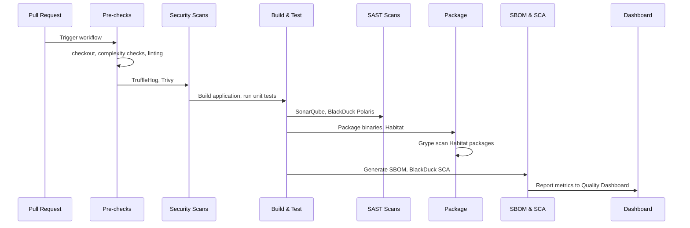

---

## Summary Table

| Tool | Type | Primary Use | Workflow File | Output Location |
|------|------|-------------|---------------|-----------------|
| SCC | Complexity | Code metrics | scc.yml | GitHub Artifacts |
| TruffleHog | Secret Scan | Credential detection | trufflehog.yml | Actions Logs |
| Trivy | Vulnerability | Dependencies & containers | trivy.yml | GitHub Artifacts/Security |
| BlackDuck Polaris | SAST | Security vulnerabilities | Inline | polaris.blackduck.com |
| SonarQube | SAST/Quality | Code quality & security | sonarqube-*-repo.yml | progress.sonar.com |
| BlackDuck SCA | SCA | License & vulnerabilities | sbom.yml | progresssoftware.app.blackduck.com |
| Grype | Vulnerability | Habitat packages | Inline | GitHub Artifacts |
| SBOM Tools | Compliance | Dependency inventory | sbom.yml | GitHub Artifacts |
| Quality Dashboard | Reporting | Aggregated metrics | irfan-quality-dashboard.yml | Atlassian Dashboard |

---

## Quick Reference: Required Secrets

| Secret | Used By | Purpose |
|--------|---------|---------|
| SONAR_TOKEN | SonarQube | Authentication to SonarQube server |
| SONAR_HOST_URL | SonarQube | SonarQube server URL |
| AKEYLESS_JWT_ID | SonarQube (public/internal) | Azure firewall rules |
| POLARIS_SERVER_URL | BlackDuck Polaris | Polaris server URL |
| POLARIS_ACCESS_TOKEN | BlackDuck Polaris | Polaris authentication |
| BLACKDUCK_SBOM_URL | BlackDuck SCA | BlackDuck SCA server URL |
| BLACKDUCK_SCA_TOKEN | BlackDuck SCA | BlackDuck SCA authentication |
| HAB_PUBLIC_BLDR_PAT | Grype/Habitat | Habitat Builder access token |
| GITHUB_TOKEN | Multiple | GitHub API authentication |

---

## Legend

- 🔵 **Blue** - Complexity/Code Quality
- 🔴 **Red** - Security Scans
- 🟡 **Yellow** - SAST Tools
- 🟢 **Green** - SBOM/SCA
- 🟣 **Purple** - Reporting/Dashboard

---

## Notes

1. **Inline vs Reusable Workflows**: Some jobs call reusable workflows (`.yml` files), while others execute steps inline within the main workflow.

2. **Conditional Execution**: Most jobs have conditions based on input flags (e.g., `inputs.perform-trufflehog-scan`).

3. **Secrets Management**: Secrets are inherited via `secrets: inherit` or explicitly passed for specific actions.

4. **Dependencies**: Jobs use `needs:` to establish execution order (e.g., most scans need `checkout` first).

5. **Parallel Execution**: Jobs without dependencies can run in parallel (e.g., TruffleHog and Trivy can run simultaneously).

6. **Version Detection**: The pipeline supports dynamic version detection from files, GitHub tags, or releases using `detect-version-source-type` and `detect-version-source-parameter` inputs.

7. **Language Support**: The pipeline supports multiple languages (Go, Ruby, Rust, JavaScript, TypeScript, Python, Java, C#, PHP) with language-specific build and test configurations.
