# CI/CD Pipeline Workflow Diagram

This document visualizes the CI/CD pipeline workflow, showing each job, the YAML files they call, and the required input variables.

## Pipeline Overview

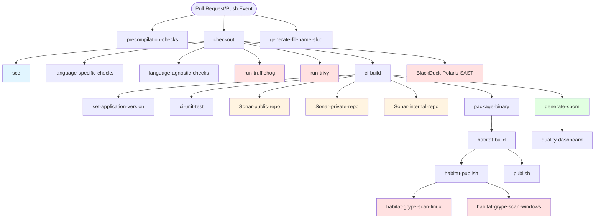

---

## Detailed Job Mappings

### 1. Source Code Complexity (SCC)

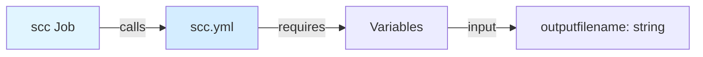

**Workflow File:** `chef/common-github-actions/.github/workflows/scc.yml`

**Required Variables:**
- `outputfilename` (string) - Name of the SCC complexity output file artifact, default: 'scc-complexity'

**Condition:** `inputs.perform-complexity-checks == true`

---

### 2. Secret Scanning (TruffleHog)

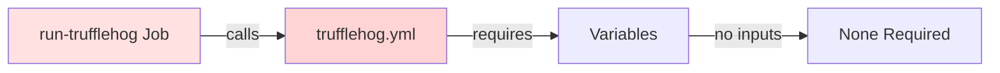

**Workflow File:** `chef/common-github-actions/.github/workflows/trufflehog.yml`

**Required Variables:**
- None (inherits secrets automatically)

**Condition:** `inputs.perform-trufflehog-scan == true`

---

### 3. Vulnerability Scanning (Trivy)

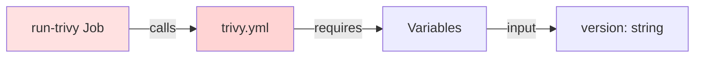

**Workflow File:** `chef/common-github-actions/.github/workflows/trivy.yml`

**Required Variables:**
- `version` (string) - Version of the project, default: '1.0.0'

**Condition:** `inputs.perform-trivy-scan == true`

---

### 4. BlackDuck Polaris SAST

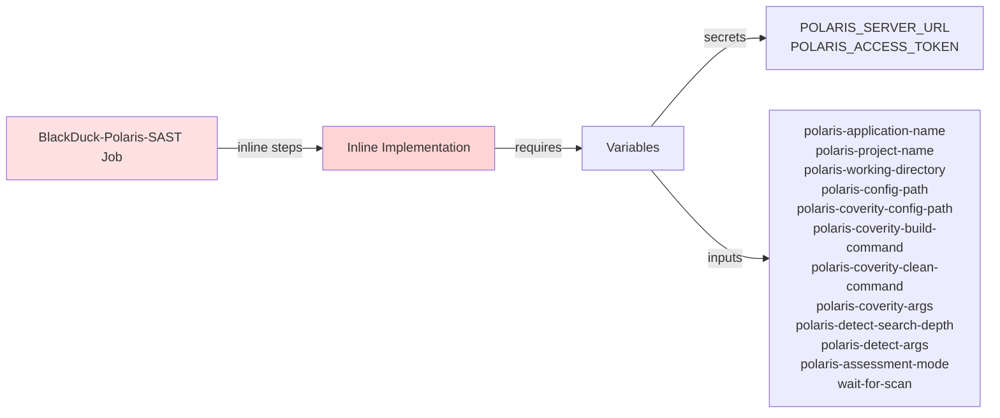

**Workflow File:** Inline implementation (no separate workflow)

**Required Secrets:**
- `POLARIS_SERVER_URL` - BlackDuck Polaris server URL
- `POLARIS_ACCESS_TOKEN` - BlackDuck Polaris access token
- `GITHUB_TOKEN` - GitHub token for authentication

**Required Variables:**
- `polaris-application-name` (string) - One of: Chef-Agents, Chef-Automate, Chef-Chef360, Chef-Habitat, Chef-Infrastructure-Server, Chef-Shared-Services
- `polaris-project-name` (string) - Typically the repository name

**Optional Variables (New in 1.0.7):**
- `polaris-working-directory` (string) - Working directory for scan
- `polaris-config-path` (string) - Path to Detect configuration file
- `polaris-coverity-config-path` (string) - Path to Coverity configuration file
- `polaris-coverity-build-command` (string) - Coverity build command
- `polaris-coverity-clean-command` (string) - Coverity clean command
- `polaris-coverity-args` (string) - Additional Coverity arguments
- `polaris-detect-search-depth` (string) - Detect search depth, default: '5'
- `polaris-detect-args` (string) - Additional Detect arguments
- `polaris-assessment-mode` (string) - Assessment mode: SAST, CI, or SOURCE_UPLOAD
- `wait-for-scan` (boolean) - Wait for scan completion, default: true

**Condition:** `inputs.perform-blackduck-polaris == true`

---

### 5. SonarQube Scans

#### 5a. SonarQube Public Repository

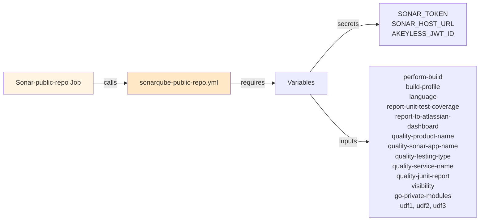

**Workflow File:** `chef/common-github-actions/.github/workflows/sonarqube-public-repo.yml`

**Required Secrets:**
- `SONAR_TOKEN` - SonarQube authentication token
- `SONAR_HOST_URL` - SonarQube server URL (progress.sonar.com)
- `AKEYLESS_JWT_ID` - For Azure firewall rules

**Required Variables:**
- `perform-build` (boolean) - Whether to perform build
- `build-profile` (string) - Build profile, default: 'cli'
- `language` (string) - Programming language
- `report-unit-test-coverage` (boolean) - Report unit test coverage
- `report-to-atlassian-dashboard` (boolean) - Report to QA dashboard
- `quality-product-name` (string) - Product name, default: 'Chef360'
- `quality-sonar-app-name` (string) - Sonar application name
- `quality-testing-type` (string) - Testing type, default: 'Integration'
- `quality-service-name` (string) - Service/repository name
- `quality-junit-report` (string) - Path to JUnit report
- `visibility` (string) - Repository visibility
- `go-private-modules` (string) - GOPRIVATE for Go modules
- `udf1`, `udf2`, `udf3` (string) - User defined flags

**Condition:** `inputs.perform-sonarqube-scan == true && inputs.visibility == 'public'`

#### 5b. SonarQube Private Repository

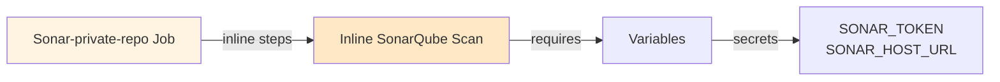

**Workflow File:** Inline implementation using `sonarsource/sonarqube-scan-action@v5.3.1`

**Required Secrets:**
- `SONAR_TOKEN` - SonarQube authentication token
- `SONAR_HOST_URL` - SonarQube server URL

**Condition:** `inputs.perform-sonarqube-scan == true && inputs.visibility == 'private'`

#### 5c. SonarQube Internal Repository

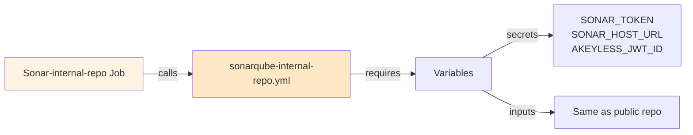

**Workflow File:** `chef/common-github-actions/.github/workflows/sonarqube-internal-repo.yml`

**Required Variables:** Same as public repository (see 5a)

**Condition:** `inputs.perform-sonarqube-scan == true && inputs.visibility == 'internal'`

---

### 6. SBOM Generation

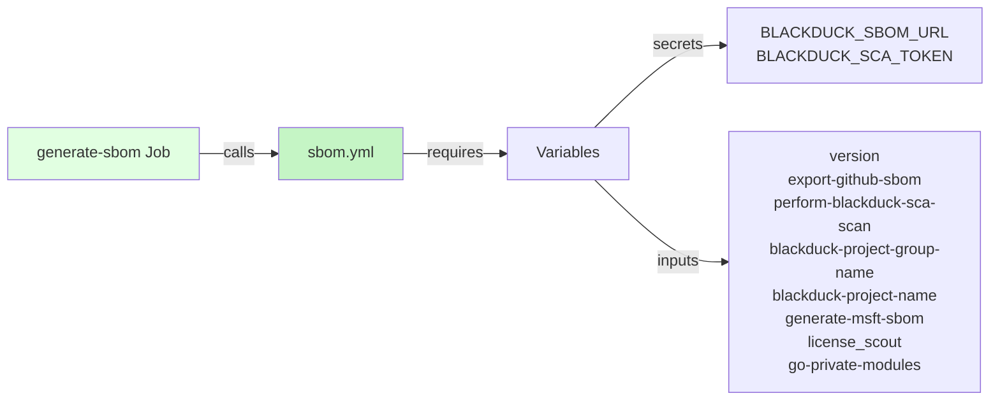

**Workflow File:** `chef/common-github-actions/.github/workflows/sbom.yml`

**Required Secrets:**
- `BLACKDUCK_SBOM_URL` - BlackDuck SCA server URL
- `BLACKDUCK_SCA_TOKEN` - BlackDuck SCA authentication token

**Required Variables:**
- `version` (string) - Version of the project
- `export-github-sbom` (boolean) - Export SBOM from GitHub
- `perform-blackduck-sca-scan` (boolean) - Perform BlackDuck SCA scan
- `blackduck-project-group-name` (string) - BlackDuck project group, default: 'Chef'
- `blackduck-project-name` (string) - BlackDuck project name
- `generate-msft-sbom` (boolean) - Generate Microsoft SBOM
- `license_scout` (boolean) - Run license scout
- `go-private-modules` (string) - GOPRIVATE for Go modules

**Condition:** `inputs.generate-sbom == true`

---

### 7. Grype Habitat Package Scanning

#### 7a. Linux Habitat Grype Scan

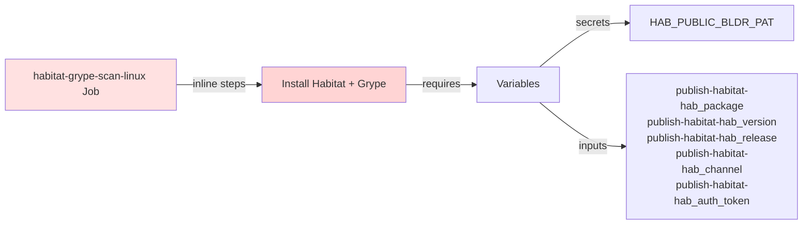

**Workflow File:** Inline implementation

**Required Secrets:**
- `HAB_PUBLIC_BLDR_PAT` - Habitat Builder personal access token (fallback)

**Required Variables:**
- `publish-habitat-hab_package` (string) - Habitat package to scan, default: 'core/nginx'
- `publish-habitat-hab_version` (string) - Package version (optional)
- `publish-habitat-hab_release` (string) - Package release (optional)
- `publish-habitat-hab_channel` (string) - Package channel, default: 'stable'
- `publish-habitat-hab_auth_token` (string) - Auth token (optional, uses secret if not provided)

**Condition:** `inputs.habitat-grype-scan == true && inputs.publish-habitat-runner_os == 'ubuntu-latest'`

#### 7b. Windows Habitat Grype Scan

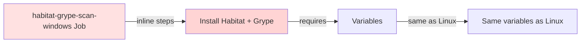

**Workflow File:** Inline implementation

**Required Variables:** Same as Linux version (see 7a)

**Condition:** `inputs.habitat-grype-scan == true && inputs.publish-habitat-runner_os == 'windows-latest'`

---

### 8. Quality Dashboard Reporting

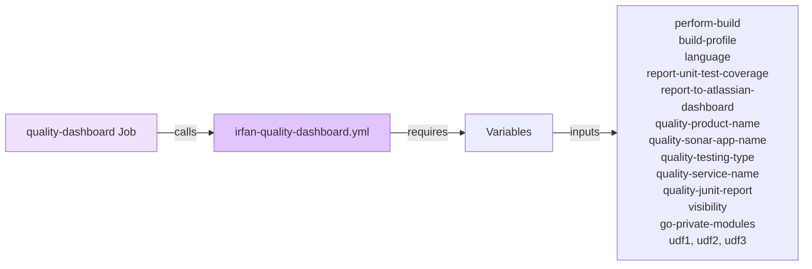

**Workflow File:** `chef/common-github-actions/.github/workflows/irfan-quality-dashboard.yml`

**Required Variables:**
- `perform-build` (boolean) - Whether build was performed
- `build-profile` (string) - Build profile
- `language` (string) - Programming language
- `report-unit-test-coverage` (boolean) - Report unit test coverage
- `report-to-atlassian-dashboard` (boolean) - Report to dashboard
- `quality-product-name` (string) - Product name (Chef360, Courier, InSpec)
- `quality-sonar-app-name` (string) - Sonar application name
- `quality-testing-type` (string) - Testing type (Unit, Integration, e2e, API, Performance, Security)
- `quality-service-name` (string) - Service/repository name
- `quality-junit-report` (string) - Path to JUnit report
- `visibility` (string) - Repository visibility
- `go-private-modules` (string) - GOPRIVATE for Go modules
- `udf1`, `udf2`, `udf3` (string) - User defined flags

**Condition:** `inputs.report-to-atlassian-dashboard == true`

---

## Pipeline Execution Flow

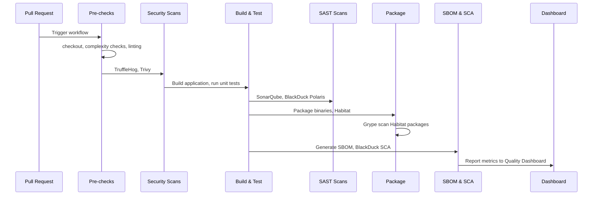

---

## Summary Table

| Job Name | Workflow File | Type | Key Variables |
|----------|--------------|------|---------------|
| scc | scc.yml | Reusable | outputfilename |
| run-trufflehog | trufflehog.yml | Reusable | None |
| run-trivy | trivy.yml | Reusable | version |
| BlackDuck-Polaris-SAST | Inline | Inline | polaris-application-name, polaris-project-name, +10 optional |
| Sonar-public-repo | sonarqube-public-repo.yml | Reusable | 15 quality/build variables |
| Sonar-private-repo | Inline (sonarsource action) | Inline | SONAR_TOKEN, SONAR_HOST_URL |
| Sonar-internal-repo | sonarqube-internal-repo.yml | Reusable | 15 quality/build variables |
| generate-sbom | sbom.yml | Reusable | version, blackduck settings, sbom flags |
| habitat-grype-scan-linux | Inline | Inline | habitat package details |
| habitat-grype-scan-windows | Inline | Inline | habitat package details |
| quality-dashboard | irfan-quality-dashboard.yml | Reusable | 15 quality/reporting variables |

---

## Legend

- 🔵 **Blue** - Complexity/Code Quality
- 🔴 **Red** - Security Scans
- 🟡 **Yellow** - SAST Tools
- 🟢 **Green** - SBOM/SCA
- 🟣 **Purple** - Reporting/Dashboard

---

## Notes

1. **Inline vs Reusable Workflows**: Some jobs call reusable workflows (`.yml` files), while others execute steps inline within the main workflow.

2. **Conditional Execution**: Most jobs have conditions based on input flags (e.g., `inputs.perform-trufflehog-scan`).

3. **Secrets Management**: Secrets are inherited via `secrets: inherit` or explicitly passed for specific actions.

4. **Dependencies**: Jobs use `needs:` to establish execution order (e.g., most scans need `checkout` first).

5. **Parallel Execution**: Jobs without dependencies can run in parallel (e.g., TruffleHog and Trivy can run simultaneously).
